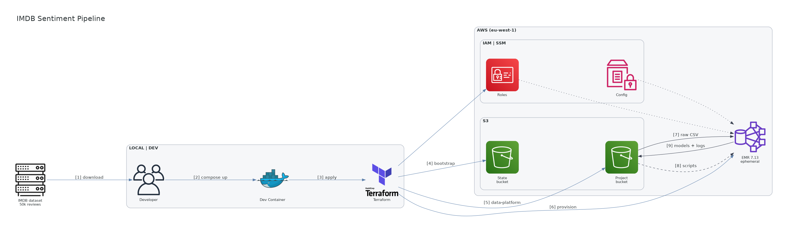
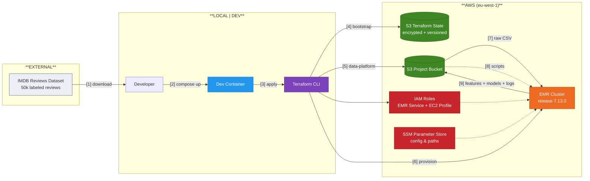

# IMDB Sentiment Pipeline - PySpark on Amazon EMR

> Distributed sentiment analysis pipeline for IMDB movie reviews, provisioned end-to-end with Terraform and orchestrated on Amazon EMR. Built as a portfolio project demonstrating Data Engineering practices for cloud-native, IaC-first, FinOps-aware data platforms.

<!-- Badges - enable after CI is configured and first push is done -->
[](https://github.com/mzanferrari/imdb-sentiment-terraform-pyspark-emr/actions/workflows/ci.yml)
[](https://www.terraform.io/)
[](https://www.python.org/)
[](https://aws.amazon.com/emr/)
[](LICENSE)

---

## Table of Contents

- [About](#about)
- [Architecture](#architecture)
- [Tech Stack](#tech-stack)
- [Project Structure](#project-structure)
- [Prerequisites](#prerequisites)
- [Quickstart](#quickstart)
- [How It Works](#how-it-works)
- [Cost Estimate](#cost-estimate)
- [Testing](#testing)
- [Troubleshooting](#troubleshooting)
- [Known Limitations](#known-limitations)
- [Insights & Lessons Learned](#insights--lessons-learned)
- [Roadmap](#roadmap)
- [License](#license)

---

## About

**Problem.** Train a binary sentiment classifier (positive/negative) on the IMDB movie reviews dataset (~50k reviews, ~63 MB CSV) using a distributed compute engine, with the entire infrastructure declared as code.

**Why this scope.** The dataset is small enough to run on a laptop with DuckDB or pandas. Using Spark + EMR for 63 MB is, on its own, **over-engineering** - and this project owns that explicitly. The point isn't to need Spark; the point is to demonstrate the full ladder of skills a Data Engineer is expected to operate end-to-end: IaC, cloud identity, distributed compute, ML feature engineering, observability, and FinOps reasoning.

**Why this is not "just another DSA course project".** Beyond the original scope, this repo adds: Architecture Decision Records, GitHub Actions CI with security scanning, automated data ingestion, FinOps-aware cluster sizing with EMR Serverless option, GDPR-aware design notes, and a roadmap connecting the same pipeline architecture to international trade data (UN Comtrade) for a domain transfer narrative.

---

## Architecture



*End-to-end data engineering portfolio project: Terraform IaC + PySpark on Amazon EMR for IMDB sentiment analysis. The diagram is generated as code with [mingrammer/diagrams](https://diagrams.mingrammer.com/); regenerate with `uv run --extra docs python docs/diagrams/architecture_diagram.py`.*

<details>
<summary>Mermaid source (renders natively on GitHub)</summary>



</details>

**Two-stage Terraform deployment.** Bootstrap creates the remote state bucket; the main stack reads from it. This pattern avoids the chicken-and-egg of "where does the state of the state bucket live".

**Configuration via SSM Parameter Store.** Bucket names and S3 paths are read from SSM at runtime - no hardcoded ARNs in the Python code. The same pipeline runs in any AWS account by changing the `project_id` variable.

---

## Tech Stack

| Layer | Tool | Why |
|---|---|---|
| **IaC** | Terraform 1.15+ | Industry standard, modular, native S3 state locking (1.10+). Pulumi/CDK considered - see ADR-001. |
| **Cloud** | AWS (eu-west-1) | EU region for data residency narrative. See ADR-002. |
| **Compute** | Amazon EMR 7.13.0 (Spark 3.5) | Managed Spark cluster. Serverless variant available - see ADR-003. |
| **Storage** | Amazon S3 + Parquet | Object storage with lifecycle policies; columnar format for analytical reads. |
| **Identity** | IAM Instance Profiles | No long-lived access keys. Workloads assume role via EC2 metadata. |
| **Config** | SSM Parameter Store | Centralized config without secrets in code. |
| **ML** | PySpark MLlib | Logistic Regression over three feature representations: HashingTF, TF-IDF, Word2Vec. |
| **Container** | Docker + docker-compose | Dev environment isolation; same Terraform/AWS CLI versions across machines. |
| **CI** | GitHub Actions | Lint (ruff), type check (mypy), tests (pytest), IaC validation (terraform fmt, tflint, trivy), secret scan (gitleaks). |
| **Quality** | Pre-commit hooks | ruff, mypy, terraform fmt, gitleaks before every commit. |
| **Observability** | Structured JSON logs -> CloudWatch | Trace IDs for distributed runs. |

---

## Project Structure

```text
.
├── infra/                              # All infrastructure as code
│   ├── bootstrap/                      # Stage 1: creates remote state bucket
│   │   ├── main.tf
│   │   ├── variables.tf
│   │   └── terraform.tfvars.example
│   └── data-platform/                  # Stage 2: project resources
│       ├── main.tf
│       ├── variables.tf
│       ├── terraform.tfvars.example
│       └── modules/
│           ├── s3/                     # Storage + SSM parameters
│           ├── iam/                    # Service & instance roles
│           ├── emr/                    # Cluster + security groups
│           └── finops/                 # Budget + SNS cost alerts
├── src/
│   └── pipeline/                       # Spark application code
│       ├── main.py                     # Entry point
│       ├── config.py                   # SSM Parameter Store reader
│       ├── logging_setup.py            # Structured JSON logger
│       ├── processing.py               # Feature engineering
│       ├── ml.py                       # Model training & evaluation
│       └── s3_io.py                    # S3 upload helpers
├── scripts/
│   ├── bootstrap_emr.sh                # Python deps (pip) on EMR cluster nodes
│   ├── check_no_pt_br.py               # Pre-commit hook: block PT-BR in public files
│   ├── empty_versioned_bucket.sh       # Purge S3 object versions for teardown
│   └── ingest_data.py                  # Automated dataset download
├── tests/
│   ├── conftest.py                     # Shared pytest fixtures
│   ├── test_config.py                  # Unit tests on config + SSM loading
│   ├── test_ingest.py                  # Unit tests on data ingestion
│   ├── test_ml.py                      # Unit tests on training helpers
│   ├── test_processing.py              # Unit tests on transform logic
│   └── test_s3_io.py                   # Unit tests on S3 path + write helpers
├── docs/
│   ├── ARCHITECTURE.md                 # System design rationale
│   ├── DEPLOYMENT.md                   # Step-by-step deployment guide
│   ├── ROADMAP.md                      # Planned evolution by phase
│   ├── diagrams/                       # Architecture diagram as code
│   │   └── architecture_diagram.py
│   └── adrs/                           # Architecture Decision Records
│       ├── 0001-iac-tool.md
│       ├── 0002-aws-region.md
│       ├── 0003-emr-deployment-mode.md
│       ├── 0004-no-pii-no-pseudonymisation.md
│       ├── 0005-cost-guardrails.md
│       ├── 0006-containerized-dev-environment.md
│       ├── 0007-sso-state-access.md
│       ├── 0008-emr-service-role-policy.md
│       └── 0009-versioned-bucket-teardown.md
├── data/                               # gitignored; populated by ingest_data.py
├── .github/
│   └── workflows/
│       ├── ci.yml                      # Lint + test + IaC validate on PR
│       └── security.yml                # Scheduled trivy + gitleaks
├── .gitignore
├── .pre-commit-config.yaml
├── pyproject.toml                      # Python deps & tool config
├── requirements.txt                    # Fallback for non-uv users
├── .devcontainer/
│   └── devcontainer.json               # VS Code dev container config
├── .dockerignore
├── Dockerfile
├── docker-compose.yml
├── Makefile                            # Common commands
└── README.md
```

---

## Prerequisites

| Requirement | Version | Notes |
|---|---|---|
| AWS account | - | Free tier is **not** sufficient; cluster will incur charges. Budget alarm recommended. |
| AWS CLI | v2.15+ | Configured via `aws configure sso` (recommended) or IAM-user credentials |
| Terraform | 1.15+ | Required for native S3 state locking |
| Docker | 24+ | Alternative to local installs |
| Python | 3.11 | Local pipeline runs and ingestion. Not 3.12 - PySpark 3.5 needs `distutils` (removed in 3.12). |
| Java (JRE) | 17 | Required by PySpark to run Spark locally (tests + local runs). `openjdk-17-jre-headless` |
| `uv` (recommended) | 0.5+ | Modern Python package manager. `pip install uv` |

---

## Quickstart

### 1. Clone and configure

```bash
git clone https://github.com/mzanferrari/imdb-sentiment-terraform-pyspark-emr.git
cd imdb-sentiment-terraform-pyspark-emr

cp infra/bootstrap/terraform.tfvars.example       infra/bootstrap/terraform.tfvars
cp infra/data-platform/terraform.tfvars.example   infra/data-platform/terraform.tfvars

# Edit the .tfvars files with your project_id (AWS account ID)
# These files are gitignored - they will NOT be committed.
```

### 2. Download the dataset

```bash
# Creates ./data/dataset.csv (~63 MB) if not present
python scripts/ingest_data.py
```

### 3. Deploy with Docker (recommended)

```bash
docker compose up -d
docker compose exec mz-p2 bash

# Inside the container:
make deploy            # runs bootstrap + data-platform Terraform stacks
```

### 4. Or deploy directly from host

```bash
make deploy
```

### 5. Monitor the run

The EMR cluster will appear in the AWS Console (EMR -> Clusters). Steps execute sequentially; logs stream to `s3://<bucket>/logs/`. The cluster auto-terminates after the last step.

### 6. Inspect results

```bash
aws s3 ls s3://<your-bucket>/output/ --recursive
aws s3 cp s3://<your-bucket>/output/ ./output/ --recursive
```

### 7. Tear down

```bash
make destroy
```

Empties the app bucket and destroys the data-platform stack. The Terraform state bucket is versioned and kept by design; to remove it too:

```bash
make destroy-state
```

See [`docs/DEPLOYMENT.md`](docs/DEPLOYMENT.md) for the full teardown rationale.

---

## How It Works

The pipeline runs in 2 EMR steps:

1. **Sync scripts S3 -> EC2.** `aws s3 cp` from `s3://<bucket>/pipeline/` to `/home/hadoop/pipeline/` (source files + built `pipeline.zip`).
2. **Run Spark application.** `spark-submit main.py <bucket-name> <project-name>` triggers the full ML pipeline:
   - Read raw CSV from S3.
   - Validate schema (`review`, `sentiment` columns).
   - Null-value report; rows with nulls dropped (with audit log entry).
   - Class balance audit (positive vs negative count).
   - Text cleaning: strip HTML tags, non-letter characters, multiple spaces; lowercase.
   - Tokenization (RegexTokenizer) + stopword removal.
   - Three parallel feature representations: HashingTF (250 features), TF-IDF, Word2Vec + MinMaxScaler.
   - Train/test split (70/30, seeded).
   - Logistic Regression with 2-fold CrossValidator over `maxIter in {10, 15, 20}`.
   - Accuracy logged; model artifacts persisted to S3.

The cluster terminates automatically after the last step completes (`keep_job_flow_alive_when_no_steps = false`), with a 10-minute idle timeout as a second guard (`auto_termination_policy`).

---

## Results

The pipeline was deployed from a clean clone and run end to end on AWS, three times, to confirm reproducibility. Three sentiment classifiers are trained on 50,000 IMDB reviews; Word2Vec features lead at 87% accuracy.

| Featurization | Accuracy |
|---|---|
| Word2Vec | 87.07% |
| HashingTF | 72.34% |
| TF-IDF | 72.34% |

Results are bit-for-bit identical across three independent clusters (deterministic: fixed seed, explicit ordering, version-pinned runtime). A full run completes in about 13 minutes for roughly $0.074, measured in Cost Explorer.

See [`RESULTS.md`](RESULTS.md) for per-run infrastructure metrics and the full cost breakdown.

---

## Cost Estimate

> Measured cost in `eu-west-1`, from AWS Cost Explorer across two validated runs on 2026-06-19. The earlier May 2026 estimate (~$0.12/run) was conservative; the measured figure is lower. Cross-reference with the [AWS Pricing Calculator](https://calculator.aws/) for other configurations.

### Default config (EMR-on-EC2, right-sized, Graviton) - measured

| Component | Cost/run |
|---|---|
| EC2 instances (master On-Demand + core Spot) | $0.0536 |
| EMR uplift | $0.0117 |
| EBS volumes | $0.0050 |
| VPC | $0.0022 |
| S3 (storage + requests) | $0.0020 |
| **Total per run** | **$0.074** |

A run lasts about 13 minutes (provisioning to auto-termination), billed per second. 10 runs/month for portfolio demos: **~$0.74/month**. See [`RESULTS.md`](RESULTS.md) for the per-run methodology.

### EMR Serverless variant (recommended for sporadic workloads)

| Resource | Rate | Per run |
|---|---|---|
| vCPU | $0.052624 / vCPU-h | ~$0.10 |
| Memory | $0.0057785 / GB-h | ~$0.04 |
| **Total per run** | | **~$0.14** |

Plus: zero idle cost, zero cluster management. See [`docs/adrs/0003-emr-deployment-mode.md`](docs/adrs/0003-emr-deployment-mode.md).

### Budget and idle-cluster alarms - provisioned by Terraform

Cost guardrails ship as code in `modules/finops` (account monthly budget with SNS alerts at 80% forecast and 100% actual) plus a CloudWatch `IsIdle` alarm in `modules/emr` that fires if a cluster sits idle for 15 minutes (a second layer behind `auto_termination_policy`). To receive the alerts, set `alert_email` in your gitignored `terraform.tfvars`; Terraform creates the SNS subscription and AWS sends a one-time confirmation link. AWS sends a one-time confirmation link. No manual budget setup is needed. An invalid address fails at `terraform plan`, before any resource is created.

---

## Testing

```bash
# All checks
make ci

# Individually
make lint              # ruff check + ruff format --check
make typecheck         # mypy --strict src/
make test              # pytest -v --cov=src tests/
make iac-fmt-check     # terraform fmt -check (no rewrite)
make iac-validate      # terraform validate on both stacks
make iac-security      # trivy config scan
```

Local pipeline run for an end-to-end smoke test (after `pip install -e .` or `uv sync`):

```bash
EXECUTION_ENV=local python -m pipeline.main <bucket-name> <project-name>
```

`EXECUTION_ENV=local` skips the S3 writes; everything else runs against the local CSV in `data/dataset.csv`.

---

## Troubleshooting

| Symptom | Probable cause | Fix |
|---|---|---|
| `terraform init` fails with `NoSuchBucket` | Bootstrap stack not yet applied | Run `terraform -chdir=infra/bootstrap apply` first |
| EMR cluster terminates immediately with `BOOTSTRAP_FAILURE` | Bootstrap script error on cluster | Check `s3://<bucket>/logs/<cluster-id>/node/<instance-id>/setup-devel.gz` |
| `NameError: path_output is not defined` | Old code, pre-fix | Pull latest from main |
| `dataset.csv not found` | Forgot to run `ingest_data.py` | `python scripts/ingest_data.py` |
| Spark job hangs at `RegexTokenizer` | Likely OOM on driver - input larger than expected | Verify `master_instance_group.instance_type` and check Spark UI |
| `AccessDeniedException` on `ssm:GetParameter` | Instance profile missing SSM read policy | Re-check `modules/iam/main.tf` - `AmazonSSMManagedInstanceCore` must be attached |

---

## Known Limitations

- **Single model family.** Only Logistic Regression is trained. Roadmap includes Random Forest, Gradient Boosted Trees for comparison.
- **No incremental processing.** Pipeline is full-refresh by design (dataset is static). For evolving datasets, see roadmap item on CDC pattern.
- **No data quality framework.** Schema check is manual via assertions. Roadmap includes `dbt tests` or `great-expectations` integration.
- **No lineage tracking.** Roadmap includes OpenLineage integration.
- **English-only text.** Cleaning pipeline assumes ASCII; international reviews would need adaptation.
- **GDPR.** Project uses public dataset with no PII. See [`docs/adrs/0004-no-pii-no-pseudonymisation.md`](docs/adrs/0004-no-pii-no-pseudonymisation.md) for design notes on a hypothetical PII-aware variant.

---

## Insights & Lessons Learned

**On engineering for the right scale.** A 63 MB dataset doesn't need Spark. The exercise here is the **pattern**, not the throughput. A real DE decision is captured in ADR-003 - when EMR is justified vs when DuckDB on a single VM is the honest answer.

**On configuration via Parameter Store.** Pulling bucket names and paths from SSM at runtime (instead of injecting via Spark args or env vars set in Terraform) means the Python code is **infrastructure-agnostic**. The same `main.py` runs in dev, staging, and prod with no code changes - only the SSM tree changes.

**On Instance Profile vs access keys.** Long-lived AWS access keys in code is the #1 cause of leaked credentials in public GitHub repos. Instance Profiles + STS for workloads, IAM Identity Center (SSO) for humans. Zero access keys in this repo by design.

**On observability.** Plain `print()` to stdout is enough for local development. Structured JSON logs (with `correlation_id` linking all log lines of a single pipeline run) is what enables debugging in distributed systems. CloudWatch Logs Insights queries JSON natively.

**On FinOps as a discipline.** A cluster you forget is more expensive than a cluster you size carelessly. `auto_termination_policy` + budget alarms + cost allocation tags are not "platform team responsibility" - they belong in every IaC commit.

---

## Roadmap

See [`docs/ROADMAP.md`](docs/ROADMAP.md) for the detailed evolution path. Highlights:

- [ ] **dbt integration** for SQL-first transformations on the curated layer.
- [ ] **Migration to EMR Serverless** as default deployment mode.
- [ ] **Apache Iceberg** as table format to enable multi-engine reads.
- [ ] **OpenLineage** instrumentation for automated lineage.
- [ ] **Apache Airflow** (or Dagster) for scheduling beyond single runs.
- [ ] **Domain swap**: replicate the pipeline architecture against **UN Comtrade** international trade data - a domain the author has 15 years of operational experience in (foreign trade, customs clearance, international logistics).
- [ ] **Streaming variant** with Kinesis Data Streams + Spark Structured Streaming.

---

## License

Distributed under the MIT License. See [`LICENSE`](LICENSE) for details.

---

## Author

**mzanferrari** - Foreign Trade specialist transitioning into Data Engineering, targeting EU-remote roles.

- GitHub: [github.com/mzanferrari](https://github.com/mzanferrari)
- LinkedIn: [linkedin.com/in/mzanferrari](https://www.linkedin.com/in/mzanferrari)

> Open to contracts and full-time positions in the EU. EEA data residency, GDPR-aware design, and FinOps-conscious architectures.
