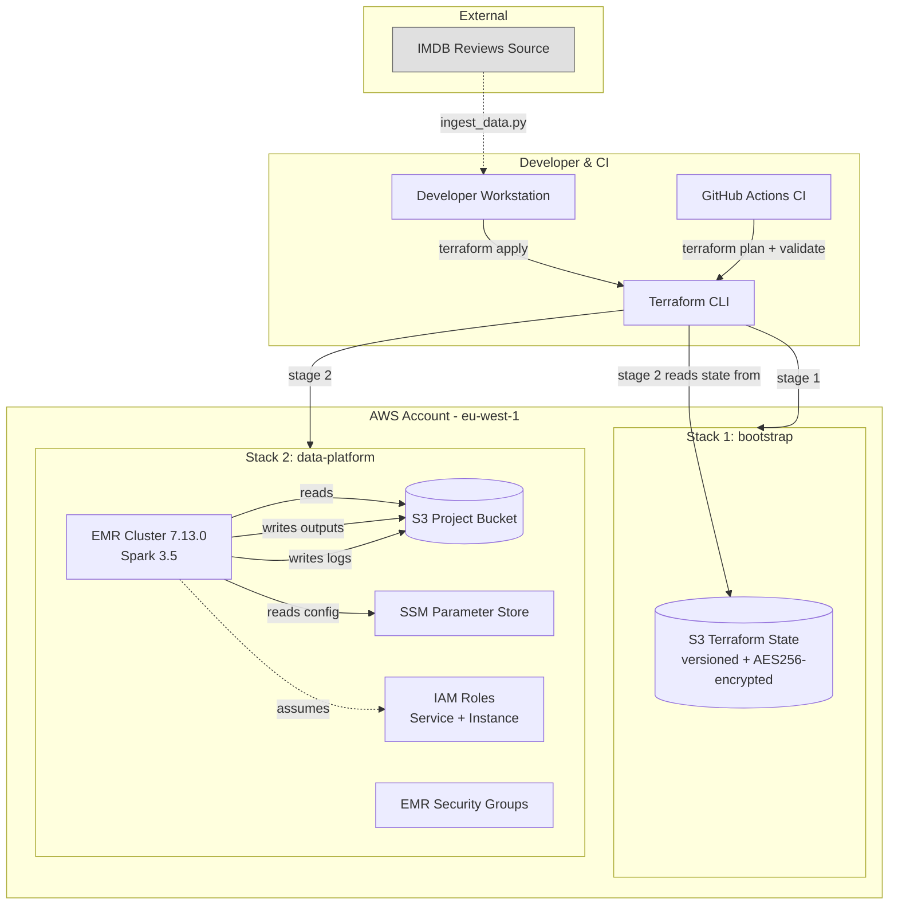
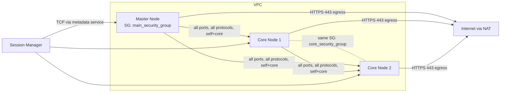

# Architecture

This document explains **how** the system is built and **why** each part is shaped the way it is. For the high-level overview, see [`../README.md`](../README.md). For specific decisions with trade-offs, see [`adrs/`](adrs/).

---

## Goals and non-goals

### Goals

- Provision the entire stack from zero with two `terraform apply` commands.
- Run a distributed sentiment training job over a labeled review dataset.
- Persist trained models and audit logs to immutable object storage.
- Demonstrate, in production-grade fashion, the practices a Data Engineer is expected to apply: IaC, IAM least privilege, observability, idempotency, FinOps.

### Non-goals

- Serve predictions in real time. (Adding an inference endpoint is in the roadmap, not in scope.)
- Train state-of-the-art language models. The classifier is intentionally simple (Logistic Regression over three feature representations) to let the engineering scaffolding be the focus.
- Be multi-cloud. The IaC is Terraform (multi-cloud capable), but the design assumes AWS primitives.

---

## System view



---

## Two-stage Terraform - why

The state-bucket-of-the-state-bucket problem: where does Terraform store the state of the bucket that stores Terraform state?

Three patterns exist:

1. **Local state for the bootstrap.** Bootstrap stack uses local state file, the file is committed (insecure) or kept on the operator's machine (single-point-of-failure). Common in tutorials, fragile in practice.
2. **Single stack, no bootstrap.** All resources including the state bucket in one stack. Terraform refuses to initialize because the backend doesn't exist yet - chicken and egg.
3. **Two-stage (this project).** Bootstrap stack creates the state bucket using local state (which is then committed to a private/gitignored location). Main stack uses remote state in that bucket. This project's choice.

The bootstrap stack itself uses local state, but the state file is small, gitignored, and survives by virtue of being trivial to recreate. If lost, `terraform import` reattaches the existing S3 bucket in two commands.

State locking on the main stack uses Terraform's native S3 lockfile mechanism (1.10+), eliminating the need for a DynamoDB lock table. One less resource, one less IAM policy.

---

## Module layout - Terraform

```text
infra/
├── bootstrap/                 # Stage 1 - runs once per environment
│   ├── main.tf                # state bucket + versioning + encryption + public access block
│   ├── variables.tf
│   ├── config.tf              # provider versions
│   └── terraform.tfvars.example
│
└── data-platform/             # Stage 2 - runs every deploy
    ├── main.tf                # composition of modules
    ├── variables.tf
    ├── config.tf              # backend "s3" with use_lockfile = true
    ├── terraform.tfvars.example
    └── modules/
        ├── s3/                # Project bucket + SSM parameters
        │   ├── main.tf
        │   ├── variables.tf
        │   └── s3_objects/    # Sub-module: uploads scripts/data to bucket
        ├── iam/               # Roles for EMR service + EC2 instances + user policy
        │   ├── main.tf
        │   ├── variables.tf
        │   └── output.tf
        ├── emr/               # Cluster definition
        │   ├── main.tf
        │   ├── security_groups.tf
        │   ├── variables.tf
        │   └── output.tf
        └── finops/             # Budget + SNS alerts + cost guardrails
            ├── main.tf
            ├── variables.tf
            └── output.tf    
```

Module boundaries are by **AWS service family** (S3, IAM, EMR) rather than by business function. Justified because:

- Permissions in AWS are scoped per service.
- Each module's variables are minimal - service-specific knobs only.
- Easier to reuse a module in unrelated projects.

---

## Application layout - Python

```text
src/pipeline/
├── __init__.py
├── main.py                    # Entry point: spark-submit target
├── config.py                  # SSM Parameter Store reader + dataclass
├── logging_setup.py           # Structured JSON logger
├── processing.py              # Feature engineering (Spark MLlib)
├── ml.py                      # Train + evaluate + persist
└── s3_io.py                   # Helpers for writing Parquet and Spark ML models
```

Separation principle: **one module per concern**. `main.py` orchestrates; each other module knows one thing.

---

## Data flow

```text
[raw CSV in S3]
        │
        v
[load + schema validation]
        │  fail-fast if columns missing or sentiment values unexpected
        v
[null reporting + drop nulls]
        │
        v
[class balance audit]
        │  logged for visibility, no action taken
        v
[label indexing: sentiment -> label]
        │
        v
[text cleaning: strip HTML, non-letters, collapse spaces, lowercase]
        │
        v
[tokenization + stopword removal]
        │
        ├--> [HashingTF (250 features)]    --> persist to s3://.../HTFfeaturizedData/
        ├--> [TF-IDF over HashingTF]        --> persist to s3://.../TFIDFfeaturizedData/
        └--> [Word2Vec (250d) + MinMaxScaler] --> persist to s3://.../W2VfeaturizedData/
                              │
                              v
              [70/30 train/test split, seeded]
                              │
                              v
              [LogisticRegression + CrossValidator (2 folds, maxIter grid)]
                              │
                              v
              [accuracy evaluation + log]
                              │
                              v
              [persist trained model to s3://.../output/<classifier>_<features>/]
```

Three feature representations in parallel because the question "which featurization wins" is the whole point of the educational exercise. In a production setting, you'd pick one based on offline benchmarks and drop the others.

---

## Identity and access (IAM)

| Principal | Trust | Permissions |
|---|---|---|
| `iam_emr_service_role` | `elasticmapreduce.amazonaws.com` | `AmazonEMRServicePolicy_v2` (managed) |
| `iam_emr_profile_role` | `ec2.amazonaws.com` | `AmazonSSMManagedInstanceCore` (managed) + customer-managed inline policy (least-privilege: project bucket, SSM parameters, CloudWatch Logs) |
| `terraform_user` (your IAM user) | n/a | Inline policy granting access to state bucket + lock object |

Principle: **no long-lived AWS access keys** are used by workloads. The EMR cluster's EC2 instances assume their instance profile role via the EC2 metadata service. The pipeline code asks `boto3` for a client; boto3 obtains short-lived STS credentials from the EC2 instance metadata service (IMDS) transparently. Zero secrets in code.

SSM access is granted through `AmazonSSMManagedInstanceCore`, which is also what enables interactive shell access to EMR core nodes via Session Manager (no SSH ports open - see security groups below).

The EC2 instance profile uses a customer-managed inline policy instead of the deprecated `AmazonElasticMapReduceforEC2Role`, which granted `s3:*`, `dynamodb:*`, `sns:*` and more on `Resource "*"`. The inline policy is scoped to only the project bucket, the project's SSM parameters, and CloudWatch Logs - the resources the cluster actually uses.

---

## Network and security groups



- **No inbound SSH port open.** Operators access nodes via AWS Session Manager (encrypted, IAM-authenticated, audited).
- **Egress permissive.** Required for S3, ECR, EMR Steps API, package downloads in bootstrap.
- **Self-referencing ingress** on core SG: nodes within the cluster talk freely.

For a production setup, you'd add VPC endpoints for S3 / STS / SSM to avoid all traffic transiting the public internet, even if it's TLS-encrypted. Documented as future work.

---

## Configuration: SSM Parameter Store as control plane

Resources created by Terraform write their identifiers into SSM under `/${project_name}/...`:

| Parameter | Source | Consumer |
|---|---|---|
| `/${project}/bucket_name` | s3 module | (informational; cross-referenced) |
| `/${project}/s3/path_raw_data` | s3 module | pipeline.config |
| `/${project}/s3/path_output` | s3 module | pipeline.config |
| `/${project}/s3/path_logs` | s3 module | (future: log forwarder config) |

Pipeline reads SSM at runtime instead of receiving everything via `spark-submit` arguments. Benefits:

- Resource renaming (a future rename of `path_output` from `output/` to `models/v2/`) is a one-line SSM update without rebuilding the pipeline.
- Audit trail: CloudTrail records who read which parameter when.
- Multi-tenant patterns: same code base reads `/team-a/...` or `/team-b/...` based on a single environment switch.

---

## Cost model

See [`adrs/0003-emr-deployment-mode.md`](adrs/0003-emr-deployment-mode.md) for the per-deployment breakdown and the EMR Serverless migration plan.

Cost categories incurred:

- **Compute** (EMR + EC2): dominant. ~85% of total in current config.
- **S3 storage** (Parquet output + logs): ~$0.023/GB-month, negligible volume.
- **S3 requests** (PutObject / GetObject during job): negligible for this workload.
- **SSM**: free at this volume.
- **Data transfer**: zero. All traffic intra-region.

Mitigations active:

- Right-sized instances (m5.xlarge master, m5.large cores)
- Spot for core nodes (~70% discount, interruption-tolerant for stateless map work)
- `auto_termination_policy` with 10-minute idle timeout
- `force_destroy` (parametrized, default false) on the project bucket; set true only for throwaway teardown
- Budget alarm + idle-cluster CloudWatch alarm (modules/finops + emr IsIdle)

Mitigations planned (H2):

- Migration to EMR Serverless (eliminates idle waste)
- Cost allocation tags applied uniformly

---

## Observability

Today:

- **Spark stdout/stderr** captured by EMR, archived in `s3://<bucket>/logs/<cluster-id>/` for 30 days post-cluster-termination.
- **Application JSON logs** emitted to stdout, captured by EMR's standard log capture.
- **Correlation ID** generated per pipeline run, included in every log line.

Future (Phase 4):

- Forward logs to CloudWatch Logs via OpenTelemetry Collector running as bootstrap script.
- Spark metrics (executor utilization, shuffle bytes, GC time) scraped via Prometheus pushgateway.
- Lineage via OpenLineage emitter in `spark-defaults.conf`.

---

## What's deliberately simple

- **One classifier family** (Logistic Regression). Could extend to Random Forest / GBT / shallow NN; not on the critical path for what this project demonstrates.
- **No feature store.** Featurized DataFrames are persisted as Parquet for inspection, not reuse across pipelines. A real ML platform would use Feast or similar.
- **No model registry.** Models are persisted by Spark ML's native save format under `s3://.../output/`. MLflow integration is roadmap.
- **No retraining schedule.** Pipeline runs on demand. Airflow/Dagster integration is roadmap.

The discipline is to **demonstrate one thing well per phase**, not to stuff every buzzword into v1.
